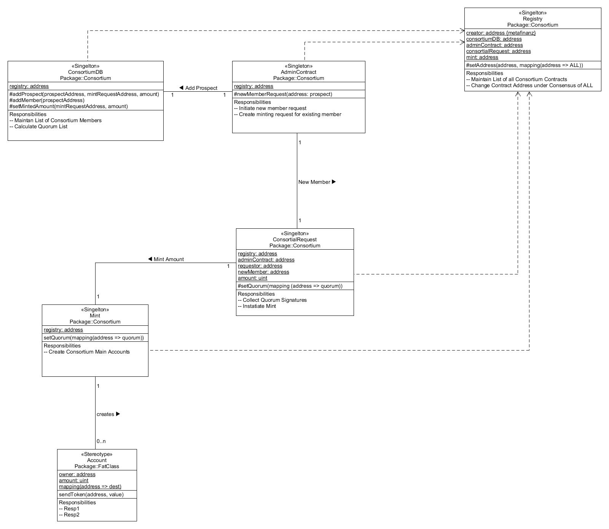

#Consortium Contracts

The consortium comprises of 5 contracts that once deployed in the block chain secure each other in a way that: 

- contracts cannot be changed 
- prospects need a majority of member signatures to join
- minting only happens upon majority
- buyin is calculated to &#x03a3; of minted coins

## Composition of Contracts

### ConsotiumRegistry
The registry binds all contracts together and, as its name suggests provides the lookup for all contracts addresses. The registry is the first contract to be created. Its address is injected into all other contratcs as constructor argument. The registry is basically a KVS where keys can only be created once. 

### ConsortiumDB
This is the main contract that holds all informations on members: 

- name
- account address
- total of coins
- status of membership
- quorum needed to sign off membership or mint
- signatureCount of member ship signatures 
- signingMembers (list of)
- mintedCount of members 
- mintedAccounts (list of)

### ConsortiumRequestHandler
Proxy contract that can only be called by members. 

- nameProspect
- approveProspect
- mintRequest
- apporveMintRequest 

### ConsortiumMint
Create all accounts for members. 

### ConsortiumAccount
Account holding coins for members. mulit sig contract (??)
 
 

